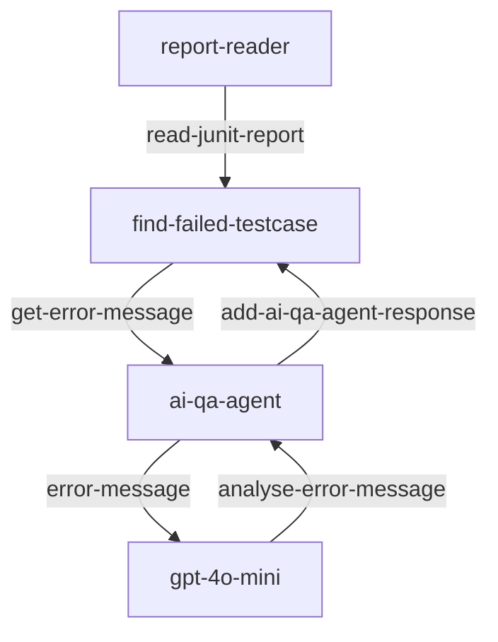
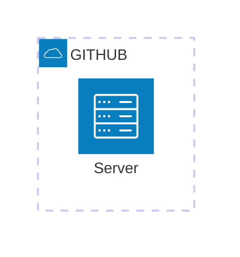

# Rest API testing with AI assisted
A sample RestAPI test by RestAssured test framework, and the testing generetats Junit Test report, the error log will be analyisted by LLM.

The AI agent uses AutoGen framework.

## Process Flow

## Architecture

