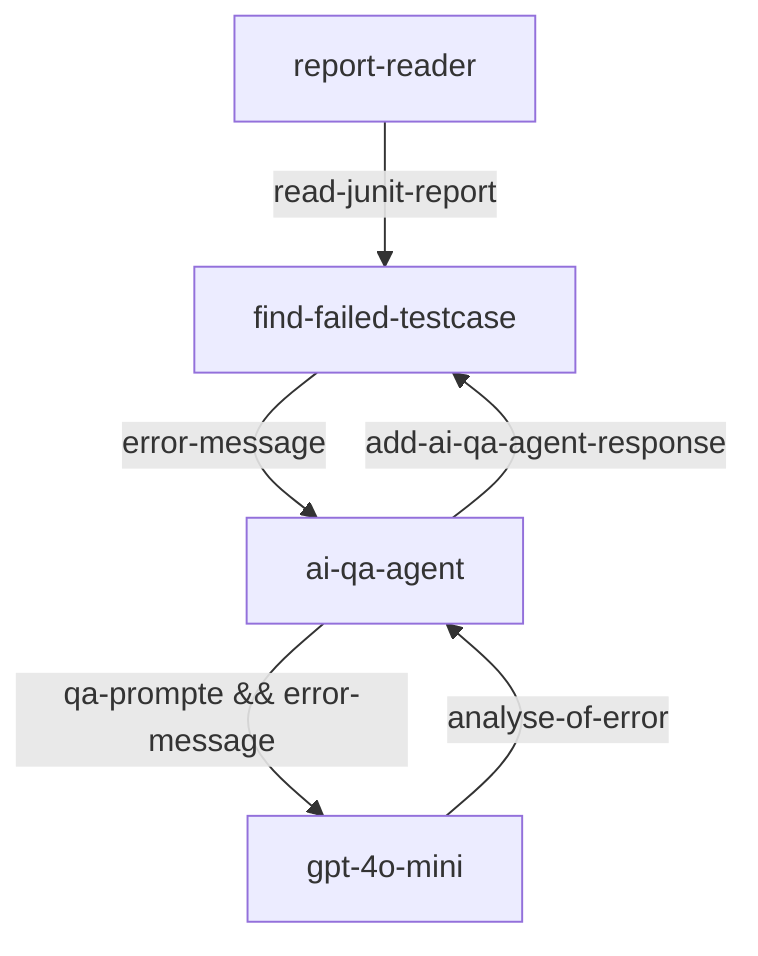

# Rest API testing with AI assisted
A sample RestAPI test by RestAssured test framework, and the testing generetats Junit Test report, the error log will be analyisted by LLM.

The AI agent uses AutoGen framework.

## Process Flow


## Architecture

```mermaid
architecture-beta
    group github(cloud)[GITHUB]
    service runner(logos:github)[Runner] in github

    group openai(cloud)[OPENAI]
    service gpt_4o_mini[gpt_4o_mini] in openai

    runner:R -- L:gpt_4o_mini
```


## AI QA agent analyses
```
AI message: 
{
    "error_message": "1 expectation failed.",
    "error_field": "Access-Control-Allow-Origin",
    "expected_value": "https://httpbin.org",
    "actual_value": "*",
    "solution": "if expectation failed, test script needs update or test api has regression issue."
} 

1 expectation failed. Expected header "Access-Control-Allow-Origin" was not "https://httpbin.org", was "*". Headers are: Date=Thu, 28 Nov 2024 22:10:31 GMT Content-Type=application/json Content-Length=556 Connection=keep-alive Server=gunicorn/19.9.0 Access-Control-Allow-Origin=* Access-Control-Allow-Credentials=true
```
